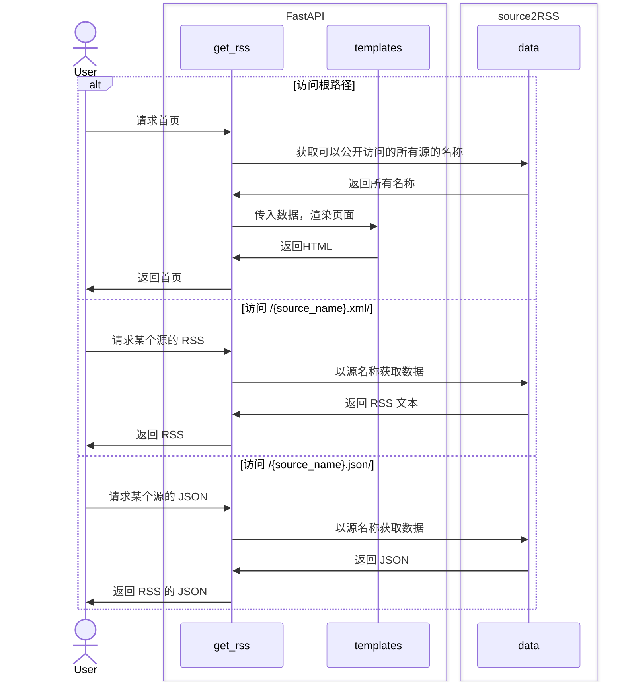
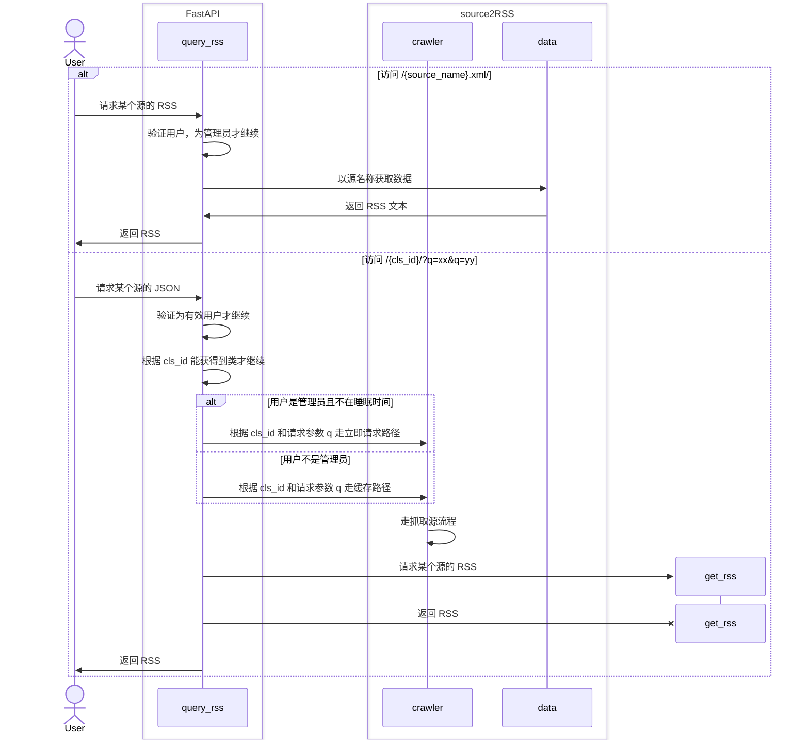
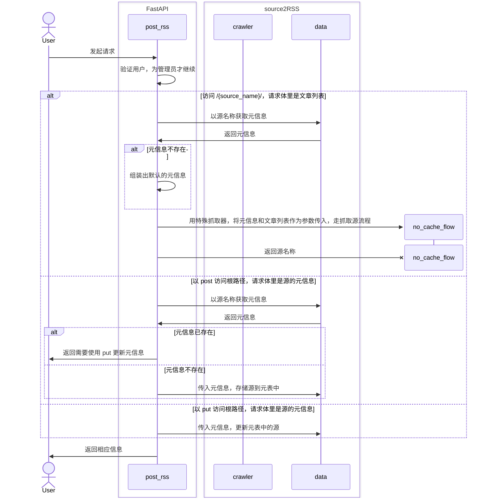
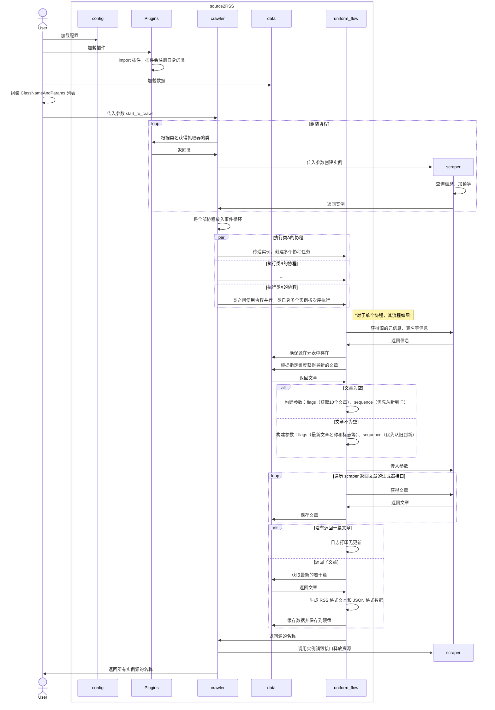

# source2RSS


source2RSS 计划成为通用的**信息源转 RSS** 的 Python 框架，目前支持两大类信息源：
1. 参考官方自带的抓取器，继承抽象基类**编写抓取器**，作为插件供主程序调用，提供网站信息流（主要用于为网站生成 RSS）
2. API 接收到的合法格式的 **JSON 数据**（主要用于将 RSS 作为提醒的渠道以及分布式所需）
3. （计划）Newsletter 转 RSS

source2RSS 将定期运行抓取器获得信息流，并更新对应的 RSS 源；或在 API 收到数据后，保存其数据，并生成 RSS 源。更多功能介绍和使用说明，请前往 GitHub 项目主页查看。

source2RSS 依赖 MongoDB 保存源的信息流和源的元信息，并在信息流中有新内容后，更新 RSS 文件，利用 Nginx 提供公开访问 RSS 的能力。

除此之外，还能选择在一台机器上只运行 crawler，将信息流发给另一台机器上完整的程序，让它负责生成 RSS。这种适合B站动态这样的信息流，在国内机器单独运行降低账号被风控的可能。

> 创建这个项目，是为了方便手动制作 RSS 源，虽然 RSSHub 等项目已经提供了很多 RSS 源，但终归不能覆盖每个人的需求，并且我并不会 JS、TS 语言，对 Python 则很熟悉。
>
> 用 Python 抓取和提取结构简单的网站数据并不困难，一般半小时就够，但是还需要制成 RSS、保留历史文章、定期运行等功能才能实际使用。
>
> 这个框架，就是为此目的开发的，只需要关注信息源的抓取和格式化，其余的交给框架，最终返回 RSS 文件。

安装步骤在博客： [信息源转 RSS 框架 - source2RSS 的安装步骤 - 技焉洲 (yanh.tech)](https://yanh.tech/2024/07/deployment-process-for-source2rss/)

> （仅）对于 Python 新人，尤其是对爬虫感兴趣的，相信这个项目很适合用作参考借鉴。同样欢迎熟悉 Python 的朋友提建议。


## 介绍使用

### 现有的抓取器

可以前往此网页查看已有的 RSS 源： [Index of /source2rss/ (vfly2.com)](https://rss.vfly2.com/source2rss/)

有几个独立博客和静态网站的抓取器，另外还有用处较广的 B站动态 和 番茄小说。
- B站动态使用 playwright 获取 cookie 从而利用 API 获得数据，使用方法为：在配置文件中启用，并添加一些初始化信息后，扫二维码登录（但是我的总是 3 天就失效）。
- 番茄小说需要有一个 root 权限的手机，下载番茄小说APP，然后还要安装 Magisk 和 LSPosed，最后在 LSPosed 加载一个模块，就能在番茄小说开启一个 API。本项目中的抓取器正是基于这个 API 获取的数据。

> 如果你有需要转 RSS 的网站，可以发 Issue，AhFei 会量力编写其抓取器（爬虫技术很一般，结构简单的静态网页，如博客一条一条的，会优先编写，最快平均一周一个）


### API 接收的合法 JSON 数据

其实还不完善，近期没需求也没空，介绍也不写了


## 程序思路

> 使用 FastAPI 监听传入的信息源，在新线程中运行定期抓取。

抓取器的工作流程
1. run_as_scheduled.py 定期运行 crawler.py
2. crawler.py 调用抓取器，获得返回的信息流（只返回新文章，无更新则直接退出）
3. 新文章保存到 MongoDB，每个信息源都有一个 collection 来保存其历史文章
4. generate_rss.py 从 collection 取出最新的 10 条，更新 RSS 文件
5. Nginx 公开 RSS 目录，从而能访问 RSS 文件

不看细节，看思路：【抓取器提供信息流】-【MongoDB 保存信息流（最终效果是存储着信息源的所有文章）】-【根据表中数据生成最新的 RSS 文件】-【Nginx 公开访问】

API 的工作流程
- 类似，只是信息流变成了收到的数据，定期执行变为了被动触发。


---

为了方便调用各位编写的抓取器，使用插件架构。

在抓取器文件中注册自身，并在配置文件里启用这个抓取器，就能在运行中，根据抓取器提供的信息源的元信息创建 collection，并保存信息流。

除了抓取器外，无须改动项目本身的代码，方便更新。


## 插件架构

通过插件架构，方便添加新网站的刮削器

> 本文中刮削器、抓取器同义


### 抓取器接口

对于结构简单的静态网站，可以查看 "scraper.cslrxyz" 这个例子，基本上只需要编写 parse 协程就可以了。

parse 方法（协程）要是一个生成器，按照一定顺序返回文章，比如时间、章节等。它要实现能获取一个网站的所有文章，即便是多页，也要整合成一条信息流一篇文章一篇文章地返回。

在抽象基类中有下面两个方法，它们是唯二的接口，也是生成器，会根据 parse 逐条读取文章并返回每次的文章。在达到一定条件后，return 退出。

```python
    async def first_add(self, amount: int = 10):
        """接口.第一次添加时用的，比如获取最新的 10 条"""
        async for a in self.__class__.parse(self.logger):
            if amount > 0:
                amount -= 1
                yield a
            else:
                return

    async def get_new(self, flag: datetime | int):
        """接口.第一次添加时，要调用的接口"""
        async for a in self.__class__.parse(self.logger):
            if a[self.__class__.key4sort] > flag:
                yield a
            else:
                return
```

比如博客，文章顺序就是首页从上到下，然后是第二页等等。除了置顶的，一般都是按照发布时间排序，从新到旧，这种抓取器的编写，就是两层循环：外层获取某一页，内存获取该页的文章列表，然后提取数据并格式化为字典，yield 返回即可。

有时候一些信息源不一定有时间条目，反而像是章节之类的，这时候可以修改类成员 key4sort = "something"，然后在返回的字典中包含 something 键，这样在生成 RSS 时，就会按照 something 排序。

**如果你要编写自己的抓取器，看明白 "scraper/example.py" 和 "scraper/cslrxyz.py" 就够了**


## 设计

源，可以是网站（HTML、JSON、RSS）、API 接口、其他程序通过 API 发来的数据等等。

一个源由两部分组成：
1. 元信息。如源的名称、源的排列方式（比如发布时间、章节数）
2. 文章。这里姑且统一叫文章，文章最少要有标题和用于排列的标志

发布时间是客观必然存在的一种排列标志，在获取源的文章时，可以按时间排序，然后仅获取更新的，再把更新的存入数据库缓存起来，避免每次都要重复获取。根据源的特点，也可以采取其他标志进行排序。

---

为了扩展性，将每个源的抓取器作为插件加载，抓取器的主要职责是根据指定顺序返回文章。

source2RSS 框架的职责主要为：
1. 定期或在 API 请求下运行抓取器，可以指定初始化参数
2. 从抓取器获取文章并保存
3. 格式化为 RSS、JSON 等数据
4. 提供 Web 提供访问

### 远程抓取器

服务 A 运行在有公网的机器上，因此承担对外提供 RSS 的功能，但是该机器性能有限，不能承担大量需要浏览器的抓取器的运行。

服务 B 运行在内网，性能较好。

一种方便服务 A 下发抓取任务给服务 B 的功能。

流程：
1. 内网服务启动后，根据配置文件向公网服务（只能有一个）发送请求，内容有：名称、支持的抓取器列表
2. 公网服务收到后，将内网服务注册，并向其返回注册成功的消息；公网服务可以注册多个内网服务
3. 内网服务和公网服务保存连接，如果意外中断或内网主动停止，则公网服务注销对应的内网服务
4. 公网可以发送需要抓取的数据给内网服务，内网服务收到后，进行相应操作，并把数据返回给公网

公网服务的配置文件中，可以对抓取器设置：本地执行、优先远程执行、必须远程执行。

优先远程意味着如果注册的内网服务中有支持该抓取器的，就用远程执行，否则通过本地。必须远程执行则在没有的情况下，不执行相应任务。

如果内网服务提供的有公网服务不支持的抓取器，公网服务同样可以使用，所有功能和自己支持的一模一样，只是在内网服务断开时，重新提示不支持。


### 抓取器流程

先省略

### Web 请求时序图

查看信息源的接口



请求信息源的接口（需要权限）



发送信息源的接口（需要权限）



### 抓取源的时序图



