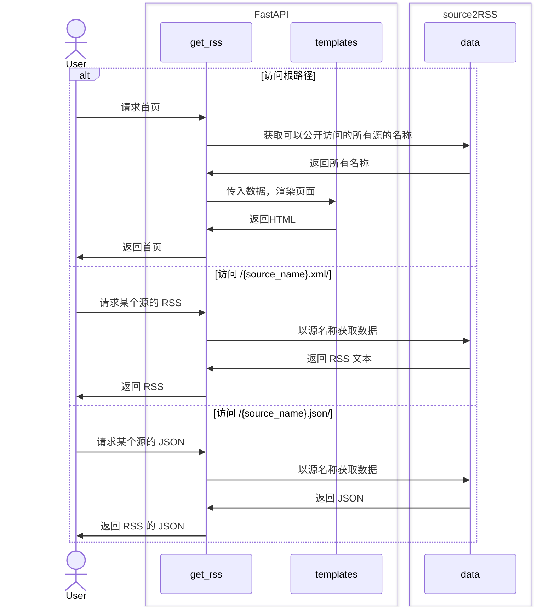
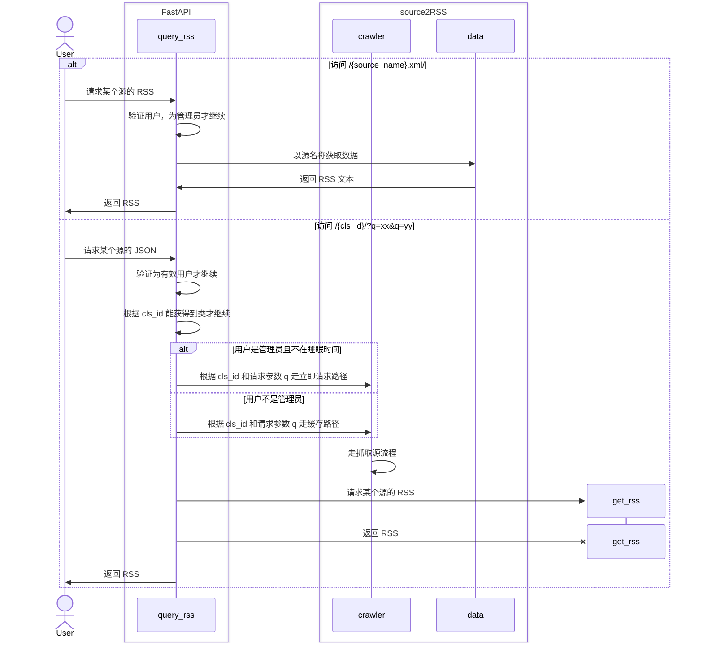
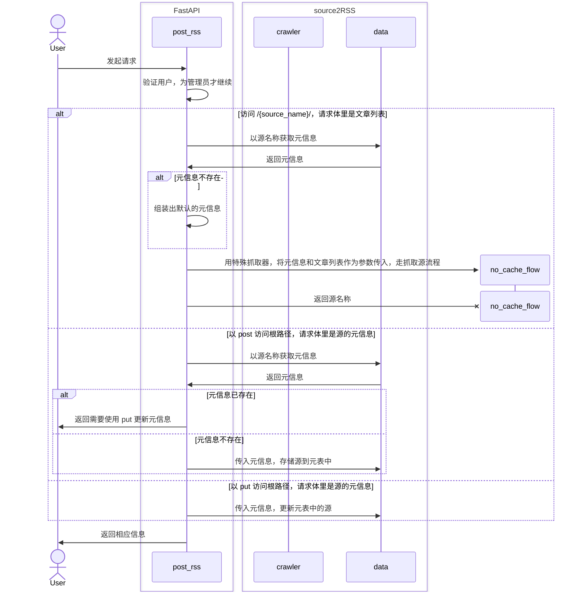
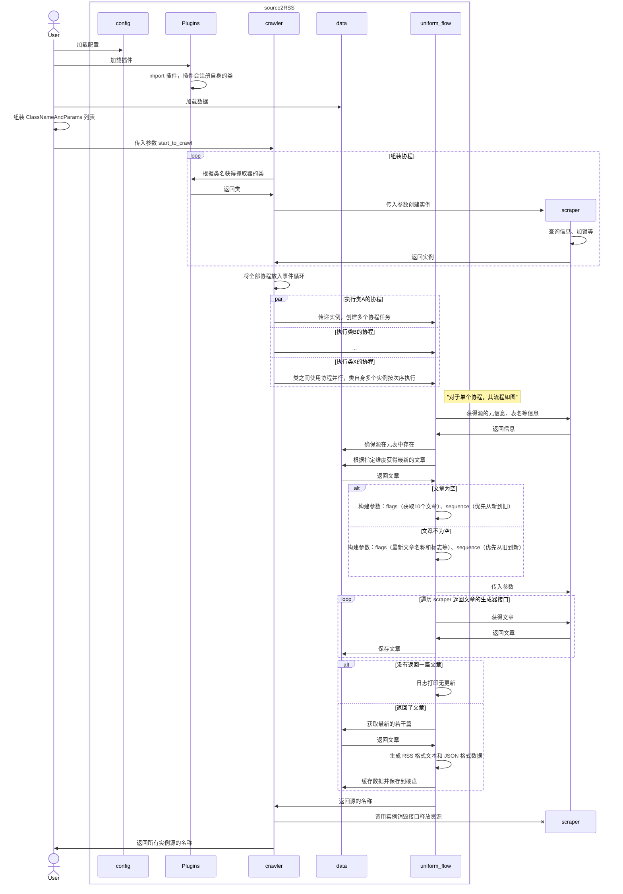

TODO 待写……

source2RSS 框架的职责主要为：
1. 定期或在 API 请求下运行抓取器，可以指定将抓取器实例化时的参数
2. 从抓取器获取文章并保存
3. 格式化为 RSS、JSON 等数据
4. 提供 Web 页面，方便使用

简化流程：【注册抓取器】-【触发（定期运行或主动触发）】-【抓取器返回新的文章】-【保存文章到数据库】-【根据表中数据生成最新的 RSS 文件】-【通过网页访问】

## 源

为了简化模型，将所有文章的输入来源都视作同一种事物，也就是“源（source）”。

源，可以是网站（HTML、JSON、RSS）、API 接口、其他程序通过 API 发来的数据等等。

一个源由两部分组成：
1. 元信息。如源的名称、源的排列方式（比如发布时间、章节数）
2. 文章。这里姑且统一叫文章，文章最少要有标题和用于排列的标志

发布时间是客观必然存在的一种排列标志，在获取源的文章时，可以按时间排序，然后仅获取更新的，再把更新的存入数据库缓存起来，避免每次都要重复获取。根据源的特点，也可以采取其他标志进行排序。

### 名称约定

这里有几个名称关系密切，需要区分清楚。

1. 抓取器的源文件的名称，如 `src/scraper/examples/cslrxyz.py`，指定插件位置时用
2. 抓取器类的名称，如 `CSLRXYZ`，实例化时用，web主动请求时指定抓取器用
3. 数据库中源的表名 table_name ，如 `cslrxyz`，不指定时则使用 source_readable_name，除了用于表名，还会用于 RSS 订阅链接，用以区分不同的 RSS，表名应该尽量只使用 ASCII 字符
4. 源的名称 source_readable_name ，用于展示，比如 RSS 中的名称，在阅读器中将会是这个 RSS 的名称，以及网页上超链接显示的名称，人类可读，因此可以使用任意字符

源文件中可以有多个抓取器类，因此这两个的名称都有作用，不能合并。

table_name 和 source_readable_name 都由类实例的 _source_info() 方法指定，因此是由编写者确定的，也是各有作用，不能和类名合并。

由于历史原因，目前项目中的 source_name 和 table_name 指同一个名称，只是在数据库相关代码里优先用 table_name，在其他地方优先用 source_name；

每个源的 name 可以重复，但是 table_name 不能重复，每个源的 name 可以用 source_readable_name 代替

## Agent

服务 A 运行在有公网的机器上，因此承担对外提供 RSS 的功能，但是该机器性能有限，不能承担大量需要浏览器的抓取器的运行。

服务 B 运行在内网，性能较好。

一种方便服务 A 下发抓取任务给服务 B 的功能。

流程：
1. 内网服务启动后，根据配置文件向公网服务（只能有一个）发送请求，内容有：名称、支持的抓取器列表
2. 公网服务收到后，将内网服务注册，并向其返回注册成功的消息；公网服务可以注册多个内网服务
3. 内网服务和公网服务保存连接，如果意外中断或内网主动停止，则公网服务注销对应的内网服务
4. 公网可以发送需要抓取的数据给内网服务，内网服务收到后，进行相应操作，并把数据返回给公网

公网服务的配置文件中，可以对抓取器设置：本地执行、优先远程执行、必须远程执行。

优先远程意味着如果注册的内网服务中有支持该抓取器的，就用远程执行，否则通过本地。必须远程执行则在没有的情况下，不执行相应任务。

如果内网服务提供的有公网服务不支持的抓取器，公网服务同样可以使用，所有功能和自己支持的一模一样，只是在内网服务断开时，重新提示不支持。

可以设置某个抓取器的执行 agent 列表，在运行时，会随机选一个执行，可以设定权重。

## 时序图

### Web 请求时序图

查看信息源的接口

请求信息源的接口（需要权限）

发送信息源的接口（需要权限）

### 抓取源的时序图

